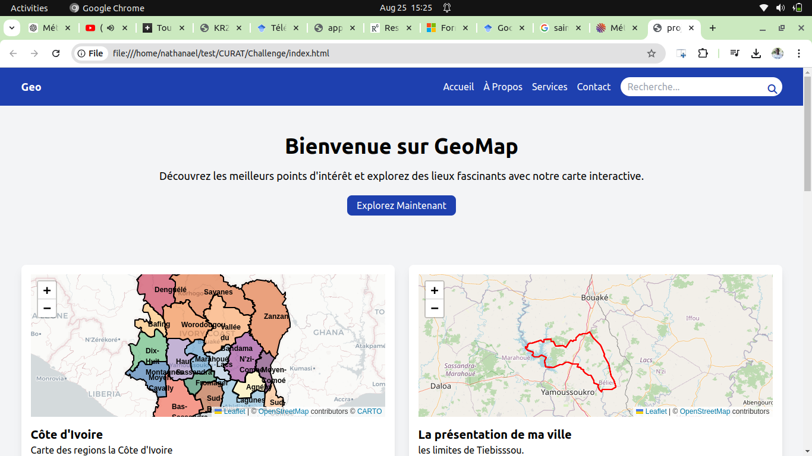

# Carte Interactive de la Souspréfecture de Tiébissou.

Ce projet est une application de cartographie interactive utilisant Leaflet.js, Turf.js et l'API OpenWeatherMap pour afficher des points d'intérêt de Tiebissou. L'application affiche également les conditions météorologiques actuelles pour chaque point d'intérêt.



## Fonctionnalités

1. **Initialisation de la Carte :**
   - Utilisation de Leaflet.js pour centrer une carte sur votre ville.
   - La carte est initialisée à un niveau de zoom approprié pour une vue d'ensemble de la ville.

2. **Ajout de Marqueurs :**
   - Ajout de marqueurs représentant au moins cinq points d'intérêt tels que des écoles, des hôpitaux et les villages.
   - Chaque marqueur affiche un pop-up contenant des informations sur le point d'intérêt.

3. **Utilisation de Turf.js :**
   - Création de buffers de 500 mètres autour de chaque point d'intérêt.
   - Ces buffers sont affichés sur la carte pour indiquer la zone d'influence de chaque point.

4. **Intégration d'une API Web :**
   - Utilisation de l'API OpenWeatherMap pour afficher les conditions météorologiques actuelles pour chaque point d'intérêt.
   - Les informations météorologiques sont affichées dans les pop-ups des marqueurs.

5. **Design et Ergonomie :**
   - L'application est conçue pour être simple d'utilisation et esthétiquement plaisante.
   - L'interface est responsive, s'adaptant à différents écrans et appareils.

## Installation

1. Clonez le dépôt :

   ```bash
   git clone https://git@github.com:yapka/Mini-Projet-JS.git
